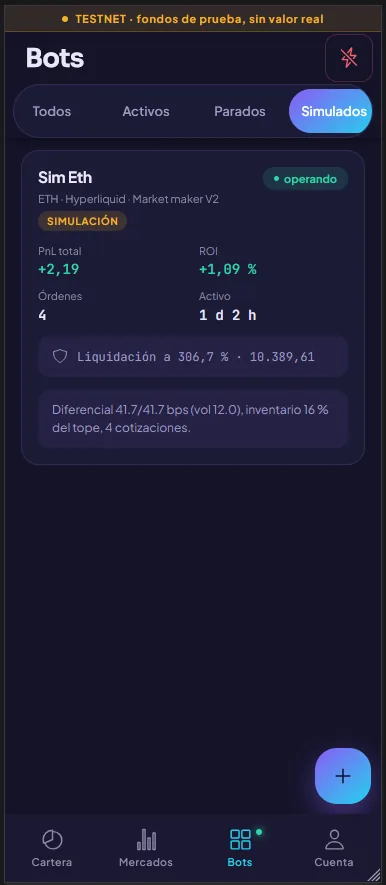
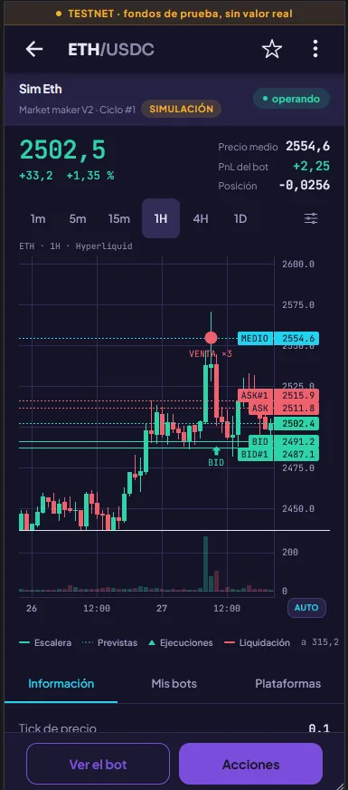
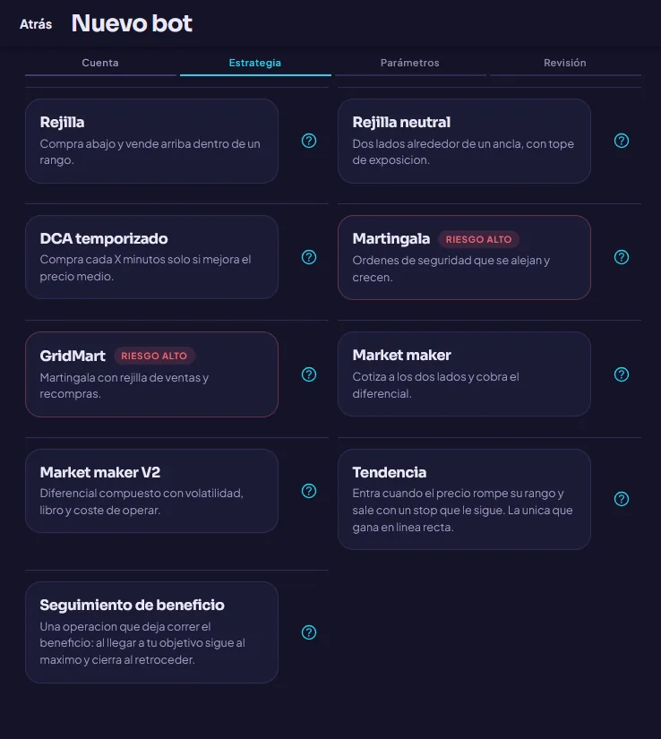

# CRYPTON

Plataforma **no custodial** de bots de trading sobre DEX, para **autoalojar**.
Los fondos nunca salen de tu cuenta del exchange: la plataforma guarda una clave
de firma delegada —una API wallet **sin permiso de retirada**— y desde ahí manda
órdenes en tu nombre.

Venues soportados: **Hyperliquid**, **Lighter** y **Aster**.

Licencia [AGPL-3.0](LICENSE).

> ### Aviso
>
> Esto opera con dinero real en mercados apalancados. **Puedes perderlo todo**, y
> con apalancamiento puedes ser liquidado en minutos. Varias de las estrategias
> incluidas —Martingale y GridMart en particular— aumentan la exposición cuando
> el precio va en contra: ese es su diseño, y es también su forma de arruinarte.
>
> El software se entrega **sin garantía de ningún tipo**. No es asesoramiento
> financiero. Quien lo despliega es el único responsable de lo que haga con él,
> incluido cumplir la normativa que le aplique. Empieza en simulación, sigue en
> testnet, y no pongas en mainnet más de lo que puedas perder entero.

---

## Cómo se ve

La app es la misma en web y en Android: Ionic compilado a las dos, sin una
pantalla escrita dos veces.

| Bots en marcha | El bot por dentro |
|---|---|
|  |  |
| Cada bot enseña su PnL, su ROI y **a qué distancia está la liquidación**, que es el número que de verdad importa cuando hay apalancamiento. Los simulados llevan su etiqueta y conviven con los reales en el mismo par. | La escalera tendida sobre las velas —`BID#1`, `ASK#1`, el precio medio— y las ejecuciones marcadas donde ocurrieron. Es lo que hay en el libro del venue ahora mismo, no una reconstrucción a posteriori. |

Y el asistente de creación, que empieza por lo que más pesa: qué estrategia, y
con cuánto riesgo.



El riesgo va declarado en la tarjeta, antes de elegir —Martingala y GridMart
llevan su aviso desde el primer paso—. Y el formulario de cada estrategia lo
genera la app sola a partir de `meta.fields`: no hay una pantalla escrita a mano
por estrategia, así que añadir una al registro de `strategy-core` la hace
aparecer aquí. Ver [Estrategias](#estrategias).

---

## Qué hay aquí

```
apps/
  api/       NestJS 11 — REST + SSE: cuentas, credenciales cifradas, CRUD de bots, preview
  worker/    NestJS 11 standalone — MOTOR DE BOTS: lease, reconciliación y ejecución
  app/       Ionic 8 + Angular 21 + Capacitor 8 → Android, y cliente web servido por nginx
packages/
  shared/          Tipos, enums, aritmética decimal y redondeo a la retícula del venue
  db/              Esquema Prisma + cliente generado y COMPILADO (Prisma 7 emite TypeScript)
  strategy-core/   Cada estrategia como funciones PURAS: validate(), preview(), plan()
  exchange-core/   Adaptadores de DEX tras una interfaz única + simulador
docker/            Dos composes SEPARADOS: infraestructura (datos) y aplicación
scripts/           Utilidades: generar .env y auditar la configuración
docs/              Guía de uso: una por estrategia, riesgo, venues, simulación y comandos
specs/             Metodología SDD: la constitución y un directorio por spec
```

### Por qué la API y el worker están separados

El motor mantiene WebSockets abiertos a los DEX y estado en memoria por bot. Si
viviera dentro del proceso HTTP, cada despliegue de la API cancelaría órdenes.
Separados, la API se reinicia sin que un bot se entere.

### La decisión que sostiene todo lo demás: reconciliación declarativa

El motor no ejecuta pasos memorizados. En cada ciclo calcula qué órdenes
*deberían* existir (`strategy.plan()`, una función pura) y las compara con las
que hay de verdad en el exchange. Solo ejecuta la diferencia.

De ahí salen tres propiedades que no hubo que programar por separado:

- **Se recupera solo.** Reinicio del worker, caída del WebSocket, una orden que
  canceles a mano desde la web del DEX: al siguiente ciclo converge.
- **Los ajustes en caliente son casi gratis.** Cambiar un parámetro solo cambia
  lo que devuelve `plan()`; el diff hace el resto. No hay una rutina de
  migración por parámetro.
- **Es testeable sin exchange.** Entran dos listas de órdenes, sale un plan.

### Lo que se comparte, y lo que no

Es la decisión que decide si esto escala a miles de bots o se queda en unas
decenas. La frontera es explícita:

| Dato | Naturaleza | Se comparte |
|---|---|---|
| Precios, libro, specs de mercado | **público** | globalmente: una suscripción por símbolo, la pidan uno o mil bots |
| Posiciones, saldos, órdenes, ejecuciones, firmante | **privado** | solo entre bots de la **misma cuenta de exchange** |
| Presupuesto de caudal | contadores | por venue e IP de salida |

El feed de precios usa un adaptador **sin credenciales**: no puede firmar nada,
así que compartirlo entre todos los usuarios no cuesta nada en seguridad. Lo
privado se comparte solo dentro de una cuenta, indexado por
`exchange_account_id`; dos cuentas del mismo usuario no comparten ni conexión ni
caché.

Compartir el adaptador por cuenta además **reduce** la presencia de la clave en
memoria: una copia por cuenta en lugar de una por bot.

### Un solo bot REAL vivo por par y cuenta

En un DEX la posición es única por cuenta y símbolo. Dos bots sobre el mismo par
verían la posición del otro como propia: promediarían sobre una cantidad que no
han abierto, se cerrarían el take profit entre ellos y la contabilidad de ambos
ciclos quedaría corrupta. Lo impide un índice único parcial en la base, y la API
lo explica con un mensaje legible antes de llegar ahí.

Los bots **simulados quedan fuera de la regla**: su posición vive en el
simulador y no compite con nadie, así que pueden convivir con un bot real en el
mismo par — el flujo natural de «simulo primero, opero después» exige
exactamente eso.

---

## Lo que tienes que poner tú

Esto se autoaloja: no hay servicio central al que conectarse ni cuenta que
crear en ningún sitio. Nada del proyecto depende de infraestructura ajena, pero
hay cuatro cosas que son tuyas y vienen sin rellenar:

| Qué | Dónde | Obligatorio |
|---|---|---|
| **Credenciales de Google OAuth** | `GOOGLE_CLIENT_ID`, `GOOGLE_CLIENT_SECRET`, `GOOGLE_REDIRECT_URI` | **Sí.** Es la única forma de entrar; sin esto la API no arranca. Se crean en Google Cloud Console, en tu propio proyecto: ver [Configurar Google](#configurar-google-una-vez) |
| **Secretos de cifrado y sesión** | `CREDENTIALS_MASTER_KEY`, `JWT_ACCESS_SECRET`, `JWT_REFRESH_SECRET` | **Sí**, pero los genera `pnpm setup` por ti |
| **Bot de Telegram** | `TELEGRAM_BOT_TOKEN`, `TELEGRAM_BOT_USERNAME` | No. Vacío, los avisos simplemente no se mandan |
| **Clave de OpenRouter** | `OPENROUTER_API_KEY` | No. Vacío, el asistente de configuración con IA queda apagado |

Dos ajustes más que conviene conocer:

- **`BUILDER_ADDRESS`** viene vacío. Es el *builder code* de Hyperliquid: con una
  dirección puesta, el protocolo adjunta una comisión a las órdenes de las
  cuentas que lo hayan aprobado (`builder_approved`, que nace en `false`). Vacío
  no se adjunta nada. Es tu decisión, no la del proyecto.
- **`AI_ADVISOR_DAILY_LIMIT`** (20 por defecto) es un tope de peticiones por
  usuario y día que protege **tu** factura de OpenRouter, no un cupo comercial.
  Súbelo si quieres. Ojo: `0` no significa «sin límite», apaga el asistente.

---

## Puesta en marcha

Requisitos: **Node ≥ 22.12** (obligatorio: el SDK de Hyperliquid es ESM-only y se
carga con `require(esm)`, que solo existe a partir de esa versión), pnpm 10 y
Docker.

```bash
pnpm install

# 1. Genera los .env con secretos compartidos donde toca
pnpm setup

# 1 bis. Rellena a mano el acceso con Google en apps/api/.env
#        (ver «Acceso» más abajo). Sin esto la API no arranca.

# 2. Postgres + Redis
pnpm infra:up

# 3. Esquema
pnpm prisma:deploy   # la migración inicial ya está versionada

# 4. Arrancar (cada uno en su terminal)
pnpm api       # http://localhost:3200/api/v1/docs
pnpm worker
pnpm app       # http://localhost:8100
```

> `pnpm setup` genera los secretos una vez y los reparte a los tres ficheros de
> entorno. La clave maestra **debe ser idéntica en la API y en el worker** —una
> cifra, el otro descifra— y hacerlo a mano falla en silencio: si no coinciden,
> ningún bot arranca y el error no señala la causa.
>
> Guárdala **fuera** del backup de la base de datos: tenerlas juntas anula el
> propósito de cifrar.
>
> Lo único que `pnpm setup` **no** puede generar es el acceso con Google:
> `GOOGLE_CLIENT_ID`, `GOOGLE_CLIENT_SECRET` y `GOOGLE_REDIRECT_URI` se crean en
> Google Cloud Console. Sin ellos la API no arranca, porque sin ellos no puede
> entrar nadie.

### Todo en contenedores

```bash
pnpm infra:up      # Postgres + Redis
pnpm stack:up      # migraciones + API + worker
pnpm stack:logs
```

Son **dos composes separados a propósito**: los datos viven en el de
infraestructura, así que `pnpm stack:down` —incluso con `--volumes`— no puede
tocar la base de datos. Desplegar la aplicación es incapaz de destruir datos.

> **Nunca ejecutes `down -v` sobre `docker/docker-compose.infra.yml`**: borraría
> todas las credenciales de exchange y el histórico de los bots.

Ver [docker/README.md](docker/README.md) para el reparto de configuración y por
qué los Dockerfiles instalan en dos pasadas.

### Android

```bash
pnpm --filter app exec cap add android   # solo la primera vez
pnpm android
```

En dispositivo o emulador la app necesita una URL **absoluta** de API: edita
`apps/app/src/environments/environment.device.ts` (`10.0.2.2` para el emulador),
y `environment.prod.ts` para el APK que vayas a repartir —esa es la
configuración por defecto de `ng build`, y viene con un dominio de ejemplo—.

Antes de publicar en cualquier tienda, **cambia el `appId`** de
`capacitor.config.ts`: `com.crypton.app` es un valor de partida y dos
aplicaciones no pueden compartirlo.

La vuelta del acceso con Google llega por el enlace profundo
`com.crypton.app://auth/callback` —el `appId` de `capacitor.config.ts`—. El
`intent-filter` que lo recoge lo genera Capacitor al hacer `cap sync`; lo que sí
hay que hacer es que `APP_REDIRECT_NATIVE` en el `.env` de la API coincida con
él, y que la API sea alcanzable desde el dispositivo.

### Despliegue

```bash
pnpm infra:up      # una vez: Postgres + Redis
pnpm stack:up      # en cada despliegue: migraciones + API + worker
```

El compose levanta la API, el worker y el cliente web (nginx) en el mismo origen,
así que no hay CORS que configurar y basta con poner un proxy inverso con TLS
delante. **Hace falta HTTPS**: el acceso con Google usa `crypto.subtle`, que el
navegador solo expone en contexto seguro.

### Escalar el motor

```bash
docker compose -f docker/docker-compose.yml up -d --scale worker=3
```

Cada réplica se queda con los bots cuyo lease consiga, hasta `WORKER_MAX_BOTS`.
No hay coordinador ni reparto explícito: si una muere, sus leases caducan y el
resto los adopta en el siguiente barrido.

> Las réplicas de un mismo compose **comparten IP de salida**, y los DEX cuentan
> sus límites por IP. Por eso deben compartir `WORKER_EGRESS_ID`: es lo que las
> hace compartir presupuesto de caudal en Redis. Si cada réplica sale por su
> propia IP, pon `WORKER_EGRESS_ID=memory` y el presupuesto se lleva dentro de
> cada proceso, sin cruzar la red.

---

## Estrategias

Viven todas en `packages/strategy-core` como funciones puras. La API las usa
para validar y pintar el preview; el worker, para ejecutar. **Una sola
implementación**, así que lo que ves antes de crear el bot es literalmente lo que
se mandará al exchange.

| Estrategia | Idea | Riesgo |
|---|---|---|
| **Grid Classic** | Compra abajo, vende arriba. Sin promediado. | Bajo |
| **Neutral Grid** | Dos lados alrededor de un ancla, con tope de exposición. | Medio |
| **TDCA** | Compra cada X minutos solo si mejora el precio medio. | Medio |
| **Martingale** | Órdenes de seguridad que se alejan y crecen. | **Alto** |
| **GridMart** | Martingala + rejilla de ventas + recompras. | **Alto** |
| **Market Maker** | Cotiza a los dos lados por bps, con sesgo por inventario. | Medio |
| **Market Maker V2** | Igual, pero el diferencial se calcula (volatilidad, libro, coste) y puede anclarse a un precio externo. | Medio |
| **Tendencia** | Entra al romper un rango y sale con un stop por ATR que sigue al precio. La única que gana en línea recta. | **Alto** |
| **Seguimiento de beneficio** | Una operación que deja correr el beneficio: al llegar a tu objetivo sigue al máximo y cierra al retroceder. | **Alto** |

Cada estrategia tiene su **guía de uso** en [`docs/README.md`](docs/README.md), con
configuraciones de ejemplo verificadas contra el código, lo que cada bot no mira
y sus limitaciones conocidas. Empieza por [`docs/buenas-practicas.md`](docs/buenas-practicas.md).

Añadir una estrategia es añadir una entrada al registro de `strategy-core`. La
app genera su formulario sola a partir de `meta.fields`: no hay código de UI por
estrategia.

---

## Ajustes con el bot en marcha

Cada parámetro declara qué ocurre si se cambia en caliente. No es una advertencia
decorativa: determina lo que hace el motor.

| Etiqueta | Comportamiento | Ejemplos |
|---|---|---|
| **HOT** | Se aplica en el siguiente ciclo. Reajusta órdenes; **la posición no se toca**. | `takeProfitPct`, distancias en bps, topes, `stopLossPct` |
| **WARM** | Cancela y vuelve a tender la escalera. **La posición sigue abierta.** Exige confirmación. | niveles, rango, escalas, `totalInvestment`, apalancamiento |
| **COLD** | Se rechaza: sería otro bot. | par, exchange, dirección, estrategia |

Más trece controles de ejecución: `START`, `PAUSE` (cancela órdenes, mantiene
posición), `RESUME`, `STOP_KEEP_POSITION`, `STOP_AND_CLOSE`, `CLOSE_NOW`,
`TAKE_PROFIT_NOW`, `ADD_SAFETY_NOW`, `REANCHOR_GRID`, `CANCEL_ALL_ORDERS`,
`PANIC`, `REPAIR` (resincroniza con el exchange sin cancelar nada) y
`ADJUST_MARGIN` (aporta o retira colateral de una posición aislada). Qué hace
cada uno, y cuáles conservan el stop-loss, en
[`docs/comandos-guardas-y-eventos.md`](docs/comandos-guardas-y-eventos.md).

Todos **cancelan solo las órdenes del bot**, nunca las de sus hermanos ni las
que hayas puesto a mano en la web del DEX. Solo el kill-switch global de
`/risk/kill-switch` tiene alcance de cuenta, que es lo que se le pide.

**Un comando no se puede perder.** La API escribe la orden en `bot_commands` en
la misma transacción que su evento, y el aviso por el bus solo adelanta la
entrega. Si el worker dueño estaba reiniciando o Redis parpadeó, el comando se
recoge en el siguiente tick. Para un PAUSE eso es una comodidad; para un PANIC,
con dinero abierto en el venue, es la diferencia entre funcionar y no funcionar.

---

## Avisos por Telegram

La vinculacion va del usuario hacia el bot: la app genera un codigo de un solo
uso y tu lo envias con `/start <codigo>`. Ese paso es lo que demuestra que el
chat es tuyo — pedir un id de chat sin mas permitiria dirigir las alertas de
cualquiera a un chat ajeno con solo adivinar un numero.

Seis categorias, con los fills **apagados** por defecto y el resumen diario
encendido: un market maker genera decenas de eventos por minuto, y notificarlos
todos entrena al usuario a silenciar el canal justo antes de que llegue el aviso
que si habia que leer. Las rafagas se agrupan en una ventana de 4 segundos y
llegan como un solo mensaje.

Solo **un** worker sondea Telegram a la vez, coordinado por un cerrojo en Redis:
`getUpdates` entrega cada mensaje una sola vez y dos lectores se los robarian el
uno al otro de forma intermitente.

Y solo **uno** envia cada aviso. El bus es pub/sub, asi que un evento llega a
todos los workers suscritos; el que notifica es el que lo publico, que por
definicion es uno solo. El resumen diario va detras de su propio cerrojo, por lo
mismo: `@Cron` dispara en todas las replicas.

---

## Ranking y copy-trading

Al ranking solo entran bots **reales** —nunca simulados—, publicados por su autor
y con al menos 6 horas de recorrido. El ROI incluye el resultado no realizado: un
bot con mucho beneficio cerrado y una posicion muy perdida abierta no es un buen
bot, y ocultarlo seria deshonesto.

**Copiar comparte la forma, no el tamano.** Los importes se guardan como
proporcion del capital y se reexpanden contra el de quien copia. Eso resuelve dos
cosas a la vez: no se revela cuanto dinero mueve el autor, y nadie con 100 USDC
despliega un bot dimensionado para 50.000. Los porcentajes y multiplicadores
viajan intactos, que es justo lo que se quiere copiar.

Copiar lleva al asistente con todo precargado, **no crea el bot**: hay que ver la
escalera y el peor caso con el capital propio antes de poner dinero.

---

## Analítica, backtest y bitácora

Lo que llegó con los specs 002-007 (el registro de decisiones está en [`specs/`](specs/README.md)):

- **El bot con su historia.** Curva del resultado acumulado (de 8 h a 30 d, con el cero visible y
  la peor caída), ciclos cerrados, coste de comisiones y reparto maker/taker; la escalera ordenada
  por precio con la distancia de cada nivel; el historial de cambios de configuración y la
  cronología por ciclo (órdenes, ejecuciones y sucesos en una sola lista); CSV al portapapeles.
- **La cartera.** Capital frente a exposición, reparto por símbolo, posiciones ordenadas por
  riesgo y la curva agregada de la cartera, que el worker materializa cada cinco minutos en
  `portfolio_snapshots` para que un bot borrado no reescriba el pasado.
- **El gráfico.** La escalera y la liquidación sobre las velas con jerarquía de rótulos, los
  sucesos del bot como marcadores, el precio medio como serie, un panel de resultado opcional y
  las acciones del bot sin salir del gráfico.
- **Backtest para todos**, sobre los bots simulados propios: reabrir una ejecución guardada,
  tabla de operaciones y comparación de dos ejecuciones lado a lado. El simulador modela las
  órdenes condicionales, así que un `stopLossPct` ya no cierra la posición en el acto.
- **Panel operativo** (administradores): la bitácora `activity_log` con resumen por acción,
  «solo fallos» y filtros.
- **La distancia a liquidación** la calcula el servidor una sola vez y las cuatro pantallas
  enseñan el mismo número, con el mismo semáforo.

Y una **metodología**: `specs/README.md` es la constitución (desarrollo dirigido por
especificación) y `CLAUDE.md` la memoria del proyecto para trabajar con un agente sin romper
nada.

---

## Sin planes ni suscripciones

No hay niveles de pago, ni cupos por tier, ni pasarela: todo lo que hace la
plataforma está disponible para quien la despliegue. Los únicos topes que
quedan son los de **riesgo**, que son otra cosa —los pone cada usuario en su
propio panel y existen para protegerle, no para venderle nada.

`BUILDER_ADDRESS` viene **vacío a propósito**. Es el *builder code* de
Hyperliquid: si pones una dirección ahí, el protocolo adjunta una comisión a las
órdenes de las cuentas que lo hayan aprobado explícitamente
(`builder_approved`, que nace en `false`). Vacío, no se adjunta nada y ningún
camino de código supone lo contrario. Quien despliegue decide.

---

## Acceso

**Solo se entra con Google.** No hay contraseñas, ni alta, ni segundo factor
propio: esta base de datos no guarda ni un hash de contraseña ni un secreto
TOTP, así que una copia robada no sirve para entrar en ningún sitio. La
verificación en dos pasos, las llaves de seguridad y la recuperación de la
cuenta las lleva Google, que lo hace mejor de lo que cabría construir aquí.

Se usa el flujo de **código de autorización con PKCE** y el intercambio hecho en
el servidor, que es lo que recomienda la RFC 8252 para aplicaciones nativas:

1. La app sortea un `verifier`, manda su SHA-256 y recibe la URL de Google.
2. Abre esa URL en el **navegador del sistema** —nunca en un WebView propio: el
   usuario tiene que poder ver que teclea su contraseña en google.com, y Google
   bloquea ese patrón precisamente por eso.
3. Google redirige a `/auth/google/callback`, en la API. El `client_secret` vive
   solo ahí y nunca viaja al dispositivo.
4. La API verifica el ID token —firma, `aud`, `nonce`, `email_verified`—,
   identifica o crea la cuenta y devuelve el control a la app con un **vale de
   un solo uso**. Los tokens de sesión no viajan por la URL: acabarían en el
   historial del navegador.
5. La app canjea el vale presentando el `verifier`. Sin él, un vale interceptado
   —en Android cualquier aplicación puede declarar el mismo esquema de enlace—
   no sirve para nada.

Los permisos pedidos son `openid` y `email`, nada más: **no** se pide el perfil,
así que ni el nombre ni la foto de Google llegan nunca. El nombre visible nace de
la parte local del correo y lo cambia el usuario.

La identidad se ata al `sub` de Google, no al correo: el `sub` no cambia jamás y
el correo sí, y enlazar por correo convertiría heredar una dirección corporativa
en heredar la cuenta y sus claves de exchange.

**Reautenticación para lo crítico.** Conectar una clave de firma o borrar la
cuenta exige haber pasado por Google en los últimos cinco minutos (`max_age=0`,
y a la vuelta se comprueba que es la misma cuenta). Un token de acceso robado
dura quince minutos y no se revalida contra la base de datos: por sí solo no
puede bastar para operar con el dinero de otro.

### Configurar Google (una vez)

1. **console.cloud.google.com** → proyecto nuevo → **APIs y servicios**.
2. **Pantalla de consentimiento de OAuth** → tipo *Externo*. Los permisos son
   `openid` y `email`, **y ninguno más**: ambos son no sensibles, así que la
   aplicación **no tiene que pasar la verificación de Google**. Añadir `profile`
   «por si acaso» sí la desencadenaría, además de recoger datos que aquí no se
   usan para nada.
3. **Credenciales → Crear credenciales → ID de cliente de OAuth → Aplicación
   web.** Una sola credencial sirve para la web y para el móvil.
4. En **URIs de redirección autorizados**, pega exactamente el valor de
   `GOOGLE_REDIRECT_URI`. Google compara la cadena entera: sobra una barra final
   y deja de funcionar. Pueden convivir el de desarrollo y el de producción.
5. **Orígenes de JavaScript autorizados: déjalo vacío.** Ese campo solo hace
   falta cuando el navegador habla con Google **por JavaScript** (Google Identity
   Services, One Tap, flujo implícito). Aquí no pasa nada de eso: la app hace una
   navegación normal a `accounts.google.com` y el canje del código lo hace la API
   en el servidor.
6. Copia el id y el secreto a `GOOGLE_CLIENT_ID` y `GOOGLE_CLIENT_SECRET`.

Hay **tres URLs** en juego y se confunden con facilidad, porque solo la primera
se registra en Google:

| Variable | Quién la conoce | Desarrollo | Producción |
|---|---|---|---|
| `GOOGLE_REDIRECT_URI` | **Google** — hay que registrarla allí | `http://localhost:3200/api/v1/auth/google/callback` | `https://api.tudominio.com/api/v1/auth/google/callback` |
| `APP_REDIRECT_WEB` | solo la API | `http://localhost:8100/auth/callback` | `https://app.tudominio.com/auth/callback` |
| `APP_REDIRECT_NATIVE` | solo la API | `com.crypton.app://auth/callback` | igual |

Lo que se registra en Google es **la URL de la API**, nunca el esquema de la app:
un cliente de tipo «aplicación web» no admite esquemas propios, y no hace falta
que lo admita. El esquema es el **segundo salto** —de la API de vuelta al
dispositivo— y lo controla `APP_REDIRECT_NATIVE`, que es configuración nuestra.
Los dos destinos de vuelta son **fijos** y la app solo elige cuál de los dos: si
la URL viniera en la petición, esto sería un redirect abierto con una sesión
recién creada dentro.

> Mientras la aplicación esté en estado **«Prueba»**, solo pueden entrar las
> cuentas añadidas como usuarios de prueba (máximo 100). Es la causa número uno
> de un «Acceso bloqueado» con credenciales perfectamente correctas. La
> caducidad de siete días que Google aplica en ese estado **no afecta aquí**:
> se pide `access_type=online` y Google no llega a emitir ningún refresh token.

Cuando algo falla:

| Síntoma | Causa |
|---|---|
| `redirect_uri_mismatch` | El URI registrado no es **idéntico** a `GOOGLE_REDIRECT_URI`: barra final, `http` vs `https`, o el puerto. |
| «Acceso bloqueado: … no ha completado el proceso de verificación» | La aplicación sigue en «Prueba» y esa cuenta no está en los usuarios de prueba. |
| `invalid_client` | El id o el secreto no corresponden a ese cliente. |
| La API no arranca: *«Falta APP_REDIRECT_WEB…»* | Faltan destinos de vuelta. `GoogleService` y `AuthService` fallan **al arrancar** a propósito: mejor eso que fallar en el primer login real. |
| Página *«Este enlace ya no vale»* | El `state` caducó (10 min) o ya se consumió: es de un solo uso. Volver a empezar desde la app. |
| Vuelves a la app con `?error=…` | `access_denied` (el usuario canceló), `email_unverified`, `account_disabled`, `email_taken` o `failed`. La app los traduce en `explicarErrorOAuth`. |

`http://localhost` está exento del requisito de HTTPS, así que en desarrollo no
hace falta ningún túnel. Para probar en un móvil real sí: el dispositivo tiene
que alcanzar la API, y el URI registrado debe ser el que el teléfono va a usar.

---

## Seguridad

- **Cifrado de sobre** (AES-256-GCM): cada credencial usa una clave de datos
  aleatoria, y esa clave se cifra con la maestra del servidor. Un volcado de la
  base sin la maestra no permite firmar ni una orden. Se usa GCM y no CBC porque
  **autentica**: manipular el texto cifrado hace que el descifrado falle, en
  lugar de devolver basura que acabaría interpretándose como una clave privada.
- El secreto se descifra **solo en memoria** del proceso que ejecuta el bot.
  Nunca en Redis, ni en disco, ni en un log.
- **Nunca se piden frases semilla.** La app avisa antes de enviar nada y la API
  las rechaza.
- Rotación de la maestra sin downtime: `CREDENTIALS_MASTER_KEY=v1:<hex>,v2:<hex>`
  con `CREDENTIALS_ACTIVE_KEY_ID=v2`.

---

## Pruebas

```bash
pnpm test              # todo
pnpm test:strategies   # la lógica de dinero: escaleras, ciclos, mutabilidad
pnpm test:adapters     # codecs, errores, caudal, presupuesto, simulador
pnpm --filter api test      # cifrado de credenciales y codec de copy-trading
pnpm --filter worker test   # reconciliación y motor de bots
pnpm check:env              # coherencia entre código, .env.example y compose
```

El grueso de la cobertura está en `strategy-core` a propósito: ahí vive la lógica
que decide cuánto dinero se pone y dónde, y es 100 % pura, así que se puede
cubrir entera sin levantar nada.

### La prueba que decide si el motor es fiable

1. Bot Grid corriendo con órdenes colocadas.
2. `docker kill crypton-worker` a mitad de ciclo.
3. Cancela 2 órdenes a mano desde la web del DEX.
4. Levanta el worker.

**Esperado:** adopta el lease, reconoce sus órdenes por `clientOrderId`, repone
exactamente las 2 que faltan, no duplica ninguna posición y deja constancia en
`bot_events`. El caso está cubierto en `apps/worker/src/engine/reconciler.spec.ts`.

Tres más que conviene hacer antes de poner dinero de verdad:

5. **Dos workers a la vez.** `--scale worker=2` y comprobar que ningún bot corre
   por duplicado (cada uno lo dice en `/health`).
6. **Dos bots en la misma cuenta, símbolos distintos.** Pausar uno y verificar
   que el otro conserva sus órdenes en el libro del DEX.
7. **Redis caído 40 s** con bots corriendo. Esperado: el worker **suelta** sus
   runners en vez de seguir operando con un lease que ya puede ser de otro.

Y una comprobación de escala, en simulación: levantar unos cientos de bots sobre
pocos símbolos y mirar que las peticiones por segundo hacia cada venue se quedan
**planas** al añadir más bots sobre símbolos y cuentas ya cubiertos. Si suben en
proporción al número de bots, algo ha dejado de compartirse.

### Orden recomendado para probar con dinero

Simulación → testnet del exchange → mainnet con 20 USDC y apalancamiento 1× →
verificar que las órdenes aparecen en la web del DEX → subir capital despacio.

El detalle de cada paso, los mínimos por venue y la checklist antes de arrancar
están en [`docs/buenas-practicas.md`](docs/buenas-practicas.md).

---

## Verificado contra infraestructura real

El esquema está materializado (22 tablas) y tanto la API como el worker arrancan
y responden. Comprobado por HTTP: acceso con Google, límites de riesgo creados al
entrar por primera vez y los 122 campos de las estrategias con su
mutabilidad.

Arrancarlo de verdad destapó dos fallos que ni compilar ni los tests detectan:

- **`start:prod` y el `CMD` de los Dockerfiles apuntaban a `dist/src/main`**,
  heredado de otro proyecto. Aquí el `dist` no tiene ese nivel, así que los
  contenedores no habrían arrancado nunca en producción.
- **`@crypton/db` se consumía como fuente TypeScript.** Prisma 7 genera TS y no
  JS, de modo que el backend compilado no podía resolver el cliente en tiempo de
  ejecución. Ahora el paquete se compila como los demás.

---

## Aviso

Operar con derivados apalancados puede hacerte perder todo tu capital. CRYPTON es
una herramienta de automatización, no un asesor financiero, y no garantiza ningún
resultado. Martingala y GridMart con apalancamiento tienen riesgo de ruina real:
el peor caso es la suma de todos los niveles multiplicada por el apalancamiento,
y aparece en el preview **antes** de crear el bot. Léelo.
